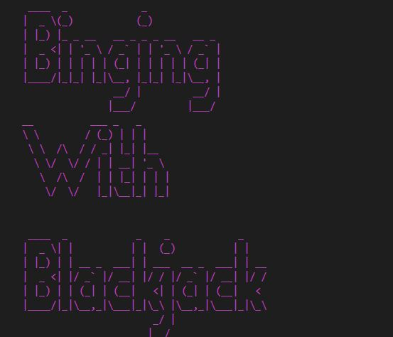
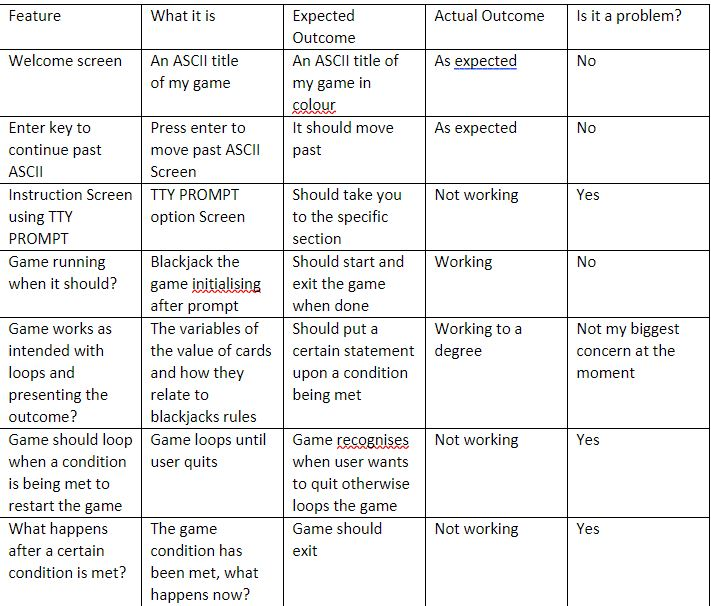

Terminal App in Ruby that replicates an authentic Blackjack experience.

# Software Development Plan

## Statement Of Purpose & Scope

## Scope

My first terminal application began with the scope of building my first 'major' project after only four weeks of learning the fundamentals of Computer Science and Ruby. The purpose of this project was to identify the many variables and personal implementation of those constructs in an individual work setting with time being what I would call limited. With a lot of pondering, rambling and straying...Basic.Blackjack was born. A Ruby game based on the great game of Blackjack.

## Purpose

The Basic.Blackjack application was built for enjoyment. The user is able to start a Blackjack game offline that simulates the real world experience one would expect walking onto any Blackjack table in the world. 

At the Ruby level, Basic.Blackjack will have all the necessities that simulate a game experience. 

1. The user will start Basic.Blackjack and be greeted with an introductory screen with an availability of options.
2. Available options will include a **'Help Guide'** to learn the rules of Basic.BlackJack
   1.  A **Casual** play game start as a quickplay options for those ready to jump into Blackjack, no stakes required and exit on demand. 
       1. A **Bet** simulation for those who want to simulate the real world of a Blackjack table (You versus the Dealer). $10 limit if the bet type with an initial $50 investment. Play up to $50 to win and be directed to a congratulations screen, or get busted to also win as long as you leave the table!. 
3. Depending on the corresponding screen selected the available options will simulate what is described above up until the user exits the application. 

## The problem & solution

### The Reasons for Development & Target Audience

At a base level, Basic.Blackjack is an offline application able to run off the users terminal allowing them to enjoy a game of Blackjack without a internet connection or any program installed. In regards to the simulated experience, Spanish 20ne aims to simulate the real world experience of gambling, specifically Blackjack, allowing you to understand and get to know the odds of Blackjack when faced at a table game level. 

For these reasons and of course a Terminal Application Assignment, I am choosing this application as I want to be able to simulate and understand a real world project in Ruby and how I am able to understand and implement the conditions of the game that has use outside of just being an assignment. 

The Target Audience for the game is anyone interested in Blackjack, either learning or familiar that wish to play the game for fun or familiarize themselves with the odds of betting blackjack. 

## Features 

1. ##### Display Menu

   ​		The first feature would be the display menu. Featuring in my application I will use the ruby Gem TTY-	PROMPT which will aid in a visual representation of a menu screen using methods such as .select and .expand. Although the variables will be aided by the TTY Gem, the use of conditional controls will be implemented as user input will be required to navigate from screen to screen within the terminal. Error handling in this section will account for rescue statements that will deal with user error regarding the option menu. 

2. ##### Blackjack the Game

   ​			The second feature would be the project itself. In my project I have used several variable types across the scope including instance and local variables. The way my thought process worked during this time, it seemed to make more sense to me to call these variable types when dealing with a wide array of variables to cover all the conditions of blackjack. Loops and conditional controls were also used heavily in my project. Certain conditions needed to be met for an authentic blackjack experience and those rules could only be intuitively thought of by using 'while' loops. While loops allowed certain parameters of decision making to be met and that is the point of where 'if', 'elsif' and 'until' loop controls were used. In essence conditional controls made the very rules of blackjack and the simulated experience work in its entirety. Error handling has been a working progress. I am trying to account for all possibilities when it does come to inputs and 'breaking' the game. I have used certain begin and rescue statements for these purposes just incase the user input is doing something unexpected, although this aspect of programming is still a bit evading for me.

   3. ####  Variables and Arrays / DRY

      ​	The third feature I would discuss in more detail are the classes and Arrays of my project and the effort to keep my code DRY. Initially starting this project, the concept of blackjack, its scope of variables and the possibly programming behind it allowed for a holistic project. The feature set for a first project when starting was exhausting as defining the simple rules behind blackjack became a project in 'DRY' principles and linking variables as to do so. The use of instance variables and hashes became essential in defining the rules of the game and furthering its use to control structures linking to my array. Upon looking back at my project, there were many ways to go about defining these rules, and if I was to ever update this code I would implement a class structure in which I can define output later. 

   

   ## 		User Interaction & Experience	

   1. ***First player is presented with a welcome screen*** in which they will navigate by pressing enter (or any other input for error handling purposes). 

   2. Once past the welcome screen the user will be presented with some menu options which will allow the user to select options based on the TTY GEM. Navigation will be neat and use the arrow keys and enter to select the indicative option. Error handing will be processed by TTY GEM which does not recognize any other input other than 'enter' and the 'arrow keys' which limits the scope of errors for the user to commit. 

   3. ***Three possibly option will be defined for the user:***

      1. Play Basic. Blackjack will take the user to the game itself.

         1. Ruby file will run blackjack the game. 
         2. Once game begins user will be dealt the original blackjack hand
         3. After this user prompt on whether to hit or stand will appear and executing code will also be error handled, returning incorrect user input followed by prompting the user again. 
         4. Once input is handled, house will follow house rules for blackjack and will hit or stand depending on value.
         5. Value between dealer and player is then summed and depending on who has the higher score will win. 
         6. User will then be asked to play again or exit
            1. If user selects to play again, the loop will restart to the default hand and begin from 2.
            2. Else the user selects to exit and will be exited back to original welcoming screen and be greeted with the same following options (Start Blackjack, HELP!, Exit)

      2. ***HELP!*** will take the user into the help screen which will define the rules of play for blackjack and how to beat the house. 

         1. Once user has read the rules and is ready to play, a prompt to exit back to the mainscreen will be error handled by TTY GEM, following incorrect input. 

         2. Once user is back at original screen user will select and restart the following steps from (1) - (3).

            

            ***Else the user will EXIT the application before starting the any of the given options.*** 

            

            

## Control Flow 

## Game Testing

